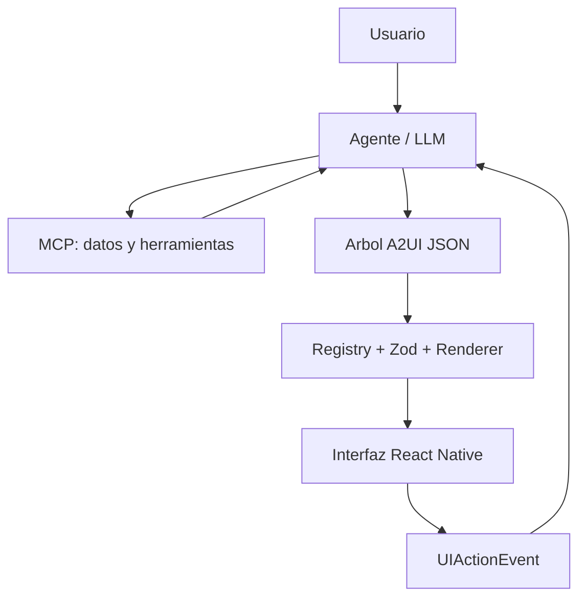

# HackMTY2026 Mobile - Generative Financial UI

Aplicacion movil de banca personal construida para el reto de UI generativa de Banorte x Tecnologico de Monterrey en HackMTY 2026.

El proyecto explora una experiencia financiera en la que un agente de inteligencia artificial no se limita a responder con texto. El agente interpreta la intencion del usuario, consulta datos y herramientas financieras, selecciona componentes registrados y produce una descripcion estructurada de la interfaz que la aplicacion renderiza en tiempo real.

> Estado actual: Inicio usa un cliente HTTP y un renderer nativo para A2UI oficial `v0.9.1`. La conexión se activa al configurar `EXPO_PUBLIC_AGENT_URL` con su despliegue; no hay conexión local. Esta documentación describe principalmente la biblioteca local anterior `GenerativeNode`, que sigue disponible pero no es el contrato de red. Consulta el [README principal](../../README.md) para la integración vigente.

## Objetivo del reto

Construir al menos un flujo financiero completo en el que:

1. El usuario expresa una necesidad financiera.
2. Un LLM interpreta la intencion y el contexto.
3. MCP proporciona datos, herramientas y acciones.
4. El LLM selecciona componentes y genera un arbol A2UI, o un JSON equivalente.
5. La aplicacion valida y renderiza ese arbol.
6. El usuario interactua con la interfaz generada.
7. La interaccion vuelve al agente como un evento estructurado.
8. El agente ejecuta una accion o genera una nueva interfaz.

El reto prioriza utilidad, adaptabilidad, calidad de IA y arquitectura. Un flujo pequeno y terminado tiene mas valor que muchas pantallas incompletas.

## Arquitectura



### Responsabilidad de cada capa

| Capa | Responsabilidad |
|---|---|
| LLM | Interpreta la intencion, decide que componentes utilizar y construye el arbol de UI. |
| MCP | Expone datos, consultas y acciones financieras al agente. |
| A2UI | Transporta una descripcion declarativa y serializable de la interfaz. |
| Registry | Define la lista blanca de componentes que el agente puede utilizar. |
| Zod | Valida nodos, propiedades y acciones antes del renderizado. |
| GenerativeRenderer | Resuelve componentes registrados y renderiza el arbol recursivamente. |
| React Native | Presenta la interfaz y captura las interacciones del usuario. |
| Action dispatcher | Convierte callbacks internos en eventos estructurados para el agente. |

### Aclaracion importante

MCP no selecciona, importa ni modifica componentes React Native. El LLM selecciona componentes; A2UI describe la interfaz; MCP proporciona datos y ejecuta herramientas; el frontend valida y renderiza los componentes registrados.

## Stack tecnico

Las versiones reportadas durante la implementacion actual son:

| Tecnologia | Version aproximada |
|---|---:|
| Expo | `~57.0.22` |
| React Native | `0.86.3` |
| React | `19.2.3` |
| Expo Router | `~57.0.21` |
| TypeScript | `~6.0.3` |
| Zod | `^3.24.2` |
| react-native-safe-area-context | `~5.7.0` |

El proyecto no utiliza NativeWind. Los componentes actuales usan primitivas de React Native, `StyleSheet`, los tokens de `src/constants/theme.ts` y `useTheme()`.

## Estructura relevante

```text
HackMTY2026_Mobile/
├── assets/
├── src/
│   ├── app/
│   │   ├── _layout.tsx
│   │   ├── index.tsx
│   │   └── settings.tsx
│   ├── components/
│   │   ├── generative/
│   │   │   ├── generative-error.tsx
│   │   │   ├── generative-renderer.tsx
│   │   │   └── index.ts
│   │   ├── layout/
│   │   │   ├── page.tsx
│   │   │   ├── section.tsx
│   │   │   ├── grid.tsx
│   │   │   ├── stack.tsx
│   │   │   └── index.ts
│   │   └── ui/
│   │       ├── action-button.tsx
│   │       ├── card.tsx
│   │       ├── divider.tsx
│   │       ├── empty-state.tsx
│   │       ├── info-banner.tsx
│   │       ├── progress-bar.tsx
│   │       ├── status-badge.tsx
│   │       ├── text-block.tsx
│   │       └── index.ts
│   ├── constants/
│   │   └── theme.ts
│   ├── features/
│   │   └── personal-banking/
│   │       ├── components/
│   │       │   ├── account-balance-card.tsx
│   │       │   ├── financial-stat-card.tsx
│   │       │   ├── spending-category-chart.tsx
│   │       │   ├── transaction-item.tsx
│   │       │   ├── transaction-list.tsx
│   │       │   └── index.ts
│   │       └── index.ts
│   ├── generative-ui/
│   │   ├── action-dispatcher.ts
│   │   ├── component-registry.ts
│   │   ├── component-schemas.ts
│   │   ├── example-interface.ts
│   │   ├── types.ts
│   │   └── index.ts
│   └── hooks/
│       └── use-theme.ts
├── AGENTS.md
├── CLAUDE.md
├── app.json
├── package.json
└── tsconfig.json
```

## Estado actual

### Infraestructura terminada

- Tipos base para nodos generativos, acciones, estados y eventos.
- Registro explicito de componentes permitidos.
- Esquemas Zod estrictos para propiedades serializables.
- Renderer recursivo sin un `switch` especifico por componente.
- Fallback visual para nodos invalidos.
- Dispatcher de acciones estaticas y payload dinamico explicito.
- Inicio conversacional con cliente HTTP y renderer A2UI en `src/features/assistant`; el árbol financiero sintético queda como ejemplo de la biblioteca anterior.
- Drawer de cuenta con Configuración, Cerrar sesión y acceso temporal al catálogo de Componentes; sin tabs.
- Soporte de tema claro y oscuro mediante tokens existentes.

### Componentes de layout

| Componente | Proposito |
|---|---|
| `Page` | Contenedor principal, area segura y scroll opcional. |
| `Section` | Agrupacion de contenido con espaciado controlado. |
| `Grid` | Distribucion responsiva basada en Flexbox. |
| `Stack` | Acomodo vertical u horizontal mediante Flexbox. |

### Componentes genericos de UI

| Componente | Proposito |
|---|---|
| `Card` | Superficie de contenido, opcionalmente interactiva. |
| `TextBlock` | Texto seguro con variantes tipograficas controladas. |
| `ActionButton` | Boton con variantes, carga, bloqueo y evento `onPress`. |
| `StatusBadge` | Estado textual con tono semantico. |
| `ProgressBar` | Progreso validado entre 0 y 100. |
| `InfoBanner` | Aviso informativo, exitoso, preventivo o de error. |
| `Divider` | Separador horizontal con sangria controlada. |
| `EmptyState` | Estado vacio con titulo y descripcion. |

### Componentes de banca personal

| Componente | Proposito |
|---|---|
| `AccountBalanceCard` | Cuenta enmascarada, saldo disponible y estado. |
| `FinancialStatCard` | Metrica de ingresos, gastos, ahorro o porcentaje. |
| `TransactionList` | Contenedor de movimientos recientes. |
| `TransactionItem` | Movimiento individual con monto, fecha, categoria y estado. |
| `SpendingCategoryChart` | Gastos agregados por categoria mediante barras horizontales. |
| `PaymentCard` | Cara de tarjeta de credito o debito: red, numero enmascarado, vigencia `YYYY-MM`, estado y monto opcional. Nunca recibe PAN, CVV ni dia de vencimiento. |
| `CreditUtilizationGauge` | Arco SVG del uso de la linea de credito con umbrales sano/moderado/alto/al limite, usado y disponible. |
| `DueDateCountdown` | Dias restantes para la fecha limite en calendario de Monterrey, con fecha de corte opcional y tono por urgencia. |
| `TrendIndicator` | Variacion contra el periodo anterior en monto y porcentaje; `inverse` marca que subir es mala noticia. |

## Contrato de UI generativa

La unidad principal es un nodo serializable:

```ts
type ComponentStatus =
  | 'idle'
  | 'loading'
  | 'ready'
  | 'empty'
  | 'error'
  | 'success';

type GenerativeAction = {
  event: string;
  tool?: string;
  payload?: Record<string, unknown>;
};

type GenerativeNode = {
  id: string;
  type: string;
  props?: Record<string, unknown>;
  children?: GenerativeNode[];
  actions?: Record<string, GenerativeAction>;
  status?: ComponentStatus;
};
```

### Ejemplo

```json
{
  "id": "main-account",
  "type": "AccountBalanceCard",
  "props": {
    "accountId": "account-001",
    "accountName": "Cuenta Enlace Personal",
    "accountType": "checking",
    "accountLastFour": "4821",
    "availableBalance": 128450,
    "currency": "MXN",
    "status": "active",
    "variant": "highlighted"
  },
  "actions": {
    "onPress": {
      "event": "view_account_details",
      "tool": "banorte_get_account_details",
      "payload": {
        "accountId": "account-001"
      }
    }
  }
}
```

## Registro de componentes

Un componente solo puede ser generado por el agente si aparece en `src/generative-ui/component-registry.ts`.

Cada entrada contiene:

- Componente React Native.
- Esquema Zod de propiedades.
- Permiso para recibir hijos.
- Lista blanca de acciones.

Ejemplo conceptual:

```ts
AccountBalanceCard: {
  component: AccountBalanceCard,
  propsSchema: accountBalanceCardPropsSchema,
  allowsChildren: false,
  allowedActions: ['onPress'],
}
```

El renderer no debe modificarse cada vez que se agrega un componente. Un componente nuevo se integra mediante su implementacion, esquema, exportacion y entrada de registro.

## Eventos y payload dinamico

Los componentes no reciben funciones desde JSON. El dispatcher transforma acciones declarativas en callbacks internos y emite un `UIActionEvent`:

```ts
type UIActionEvent = {
  event: string;
  componentId: string;
  tool?: string;
  payload?: Record<string, unknown>;
};
```

Los callbacks que necesitan informacion de la interaccion deben enviar un objeto plano explicito:

```ts
onCategoryPress?.({ category: item.category });
```

No se infieren propiedades a partir de nombres como `onCategoryPress` o `onDateChange`.

El dispatcher combina el payload dinamico con el payload declarado en A2UI. Los datos declarados por A2UI tienen prioridad:

```ts
const mergedPayload = {
  ...runtimePayload,
  ...(actionConfig.payload ?? {}),
};
```

Ejemplo resultante:

```json
{
  "event": "spending_category_selected",
  "componentId": "monthly-spending-chart",
  "tool": "banorte_get_transactions_by_category",
  "payload": {
    "category": "food",
    "accountId": "account-001",
    "period": "2026-09"
  }
}
```

## Convenciones financieras

### Montos

- Los montos viajan como numeros, nunca como cadenas preformateadas.
- Los cargos y gastos utilizan numeros negativos.
- Los abonos e ingresos utilizan numeros positivos.
- El signo depende del valor numerico, no de `tone`, categoria o color.
- Cada componente formatea la moneda mediante `Intl.NumberFormat('es-MX')`.
- Las monedas permitidas actualmente son `MXN` y `USD`.

### Cuentas

- Nunca se envia ni muestra el numero completo de una cuenta.
- `AccountBalanceCard` acepta unicamente los ultimos cuatro digitos.
- Los datos de ejemplo son sinteticos y no representan clientes reales.

### Fechas

- Las fechas viajan como cadenas ISO 8601.
- Los esquemas deben validarlas estrictamente.
- La presentacion utiliza formato regional mexicano.

### Categorias actuales

```text
food
transport
entertainment
utilities
health
shopping
income
transfer
other
```

## Seguridad del renderer

El arbol generado se considera entrada no confiable.

Reglas obligatorias:

- Rechazar componentes no registrados.
- Validar todas las propiedades con esquemas `.strict()`.
- No aceptar funciones dentro del JSON.
- No aceptar objetos `style` arbitrarios.
- No aceptar colores o clases arbitrarias.
- No ejecutar codigo recibido como texto.
- No utilizar `eval`, `Function` o imports dinamicos definidos por el modelo.
- No aceptar HTML arbitrario ni `dangerouslySetInnerHTML`.
- No permitir que un componente visual llame MCP directamente.
- Rechazar payloads dinamicos que no sean objetos planos.
- No permitir que un payload dinamico reemplace parametros protegidos declarados en A2UI.
- Mostrar un error controlado sin derribar toda la pantalla.

## Navegación y sesión

Los tabs fueron eliminados. La ruta temporal `explore.tsx` vuelve a estar disponible desde la opción Componentes del drawer, con el catálogo local anterior y una vista de los componentes A2UI `v0.9.1` soportados. Sus interacciones son locales y no hacen peticiones. Inicio es la única superficie financiera; Configuración edita datos de cuenta y se abre desde el drawer. Consulta el [README principal](../../README.md) para configurar Supabase, revisar el modo sin sesión y conocer la integración HTTP y el renderer oficial.

## Ejecucion local

### Requisitos

- Node.js compatible con la version de Expo del proyecto.
- npm.
- Expo Go, emulador Android o navegador web.

### Instalacion

```bash
npm install
```

### Desarrollo

```bash
npx expo start -c
```

Desde la consola de Expo:

- Presionar `a` para Android.
- Presionar `w` para web.
- Presionar `i` para iOS cuando el entorno lo permita.
- Escanear el codigo QR para utilizar Expo Go.

### Verificacion estatica

```bash
npx tsc --noEmit
npx eslint src/components src/features src/generative-ui src/app
```

Existe una advertencia preexistente del template en `src/hooks/use-color-scheme.web.ts` relacionada con `react-hooks/set-state-in-effect`. No debe ocultarse ni mezclarse con errores introducidos por componentes nuevos.

## Prueba manual minima

Antes de integrar cambios:

1. Abrir la pantalla principal y confirmar que el arbol financiero se renderiza.
2. Presionar la cuenta y verificar `view_account_details`.
3. Presionar un movimiento y verificar `view_transaction_details`.
4. Seleccionar una categoria y verificar `spending_category_selected`.
5. Abrir la pestana Explorar y revisar el catalogo completo.
6. Confirmar que botones bloqueados o cargando no ejecutan acciones.
7. Revisar modo claro y oscuro.
8. Revisar telefono vertical, horizontal y Expo Web.
9. Confirmar que no exista scroll horizontal ni contenido tapado por las pestanas.
10. Ejecutar TypeScript y ESLint.

## Como agregar un componente generativo

Seguir siempre este orden:

1. Definir el problema y las propiedades serializables.
2. Crear el componente React Native.
3. Separar callbacks internos de propiedades A2UI.
4. Crear un esquema Zod estricto.
5. Exportar el componente y sus tipos.
6. Agregarlo a `componentRegistry`.
7. Definir `allowsChildren` y `allowedActions`.
8. Agregar un ejemplo JSON.
9. Mostrarlo en el catalogo cuando tenga variantes visuales.
10. Probar propiedades validas, invalidas, estado vacio y eventos.
11. Ejecutar TypeScript y ESLint.

Ejemplo de registro:

```ts
NewComponent: {
  component: NewComponent,
  propsSchema: newComponentPropsSchema,
  allowsChildren: false,
  allowedActions: ['onPress'],
}
```

### Criterio para crear un componente nuevo

Crear un componente cuando represente una pieza visual o financiera reutilizable con un contrato estable. No crear un componente diferente para cada pantalla, texto o respuesta del agente.

## Referencia visual

BKLit se utiliza como referencia para composicion, jerarquia visual e interacciones de graficas. Sus componentes web no deben importarse directamente dentro de React Native.

La implementacion movil debe utilizar primitivas compatibles con Expo. Para graficas SVG futuras se puede evaluar `react-native-svg` usando `npx expo install react-native-svg`, despues de revisar la compatibilidad con la version actual de Expo.

## Proximo flujo por definir

Antes de construir mas componentes se debe seleccionar un solo flujo de banca personal. Ejemplos:

- Comprender y controlar gastos.
- Crear un presupuesto por categoria.
- Ahorrar para una meta.
- Simular pagos para reducir intereses.
- Consultar movimientos inusuales.

Para definirlo se necesita responder:

1. Que intencion inicia el flujo.
2. Que datos debe consultar el agente.
3. Que componentes debe mostrar.
4. Que puede tocar o modificar el usuario.
5. Que herramienta MCP ejecuta la accion.
6. Que cambio visible confirma el resultado.

## Roadmap preliminar

### Completado

- Infraestructura A2UI local.
- Registro y validacion.
- Renderer recursivo.
- Eventos con payload dinamico explicito.
- Layout y primitivas visuales.
- Resumen de cuenta y metricas.
- Lista de movimientos.
- Grafica de gastos por categoria.
- Catalogo visual.

### Siguiente, despues de definir el flujo

- Selectores de cuenta y periodo.
- Filtros o chips de categoria.
- Formularios monetarios.
- `CashFlowChart` si el flujo lo necesita.
- `BudgetProgress` y `BudgetForm` para control de gasto.
- Confirmacion y resultado de acciones.
- Estados generativos `loading`, `empty`, `error` y `success`.

### Integracion posterior

- Contrato del backend del agente.
- Herramientas MCP reales o simuladas.
- Transporte HTTP, SSE o WebSocket.
- Salida estructurada del LLM.
- Actualizaciones sucesivas del arbol A2UI.
- Pruebas del ciclo completo.

## Instrucciones para asistentes de IA

Antes de modificar el proyecto:

1. Leer completamente `AGENTS.md`, `CLAUDE.md` y este README.
2. Inspeccionar el codigo real; no asumir que el reporte anterior coincide con el arbol actual.
3. Ejecutar `git status` y respetar cambios existentes.
4. Trabajar de forma incremental.
5. No reconstruir la arquitectura terminada.
6. No modificar `GenerativeRenderer` para agregar condiciones especificas de negocio.
7. No conectar MCP o red salvo que la tarea lo solicite expresamente.
8. No agregar dependencias sin justificar su necesidad y compatibilidad con Expo.
9. No presentar como terminado un componente que no aparezca en `git status` o `git diff`.
10. Ejecutar TypeScript y ESLint antes de entregar.

Cada entrega debe indicar:

- Archivos creados y modificados.
- Componentes y variantes agregadas.
- Esquemas y entradas de registro.
- Ejemplo A2UI.
- Eventos esperados.
- Pruebas ejecutadas.
- Limitaciones reales.
- Commit sugerido siguiendo Conventional Commits.

## Convencion de commits

El proyecto utiliza Conventional Commits.

Ejemplos:

```text
feat(ui): add generic component library and visual catalog
feat(personal-banking): add transaction history components
feat(personal-banking): add interactive spending category chart
fix(generative-ui): require explicit runtime action payloads
docs: document generative UI architecture and component workflow
```

No incluir archivos no relacionados dentro del mismo commit.

## Limitaciones actuales

- Los datos de la demostracion son sinteticos y locales.
- No existe conexion real con un agente LLM.
- No existe transporte HTTP, SSE o WebSocket para actualizar el arbol.
- Las herramientas nombradas en los eventos todavia no son llamadas MCP reales.
- No existe persistencia real de presupuestos o acciones.
- `ComponentStatus` esta tipado, pero todavia falta una estrategia completa de skeletons y estados remotos.
- El flujo financiero definitivo todavia debe seleccionarse y documentarse.

## Licencia

Consultar el archivo `LICENSE` del repositorio.

## AreaChart

Gráfico de áreas para iOS, Android y web, inspirado en [Bklit Area Chart](https://bklit.com/docs/components/area-chart). Disponible desde `@/components/ui` y en el catálogo del drawer. Usa SVG nativo, curvas monótonas, degradados, cuadrícula, ejes, leyenda, animación de entrada y tooltip con indicador vertical. Permite seleccionar con toque, arrastre horizontal, cursor, teclas de flecha en web y acciones de accesibilidad. Respeta movimiento reducido.

```tsx
<AreaChart
  title="Ingresos y gastos"
  currency="MXN"
  series={[
    { id: 'income', label: 'Ingresos', tone: 'blue' },
    { id: 'spend', label: 'Gastos', tone: 'violet' },
  ]}
  data={[
    { label: 'Ene', values: [12000, 8500] },
    { label: 'Feb', values: [15800, 9200] },
    { label: 'Mar', values: [14200, 8100] },
  ]}
  onPointSelect={({ index, label, values }) => { /* evento local */ }}
/>
```

Acepta hasta cuatro series y 240 puntos. Cada punto debe contener un valor finito por serie; se admiten valores negativos, ceros y una sola muestra. `height` controla la altura (180–500), `status="loading"` muestra carga y `data={[]}` muestra el estado vacío. La paleta admite `blue`, `violet`, `green` y `orange`; no recibe estilos o código arbitrarios desde JSON.

Se registra como `AreaChart` en el renderer local `GenerativeNode`, con `areaChartPropsSchema` y la acción local `onPointSelect`. Finance Catalog v1 también lo alcanza exclusivamente mediante el adaptador A2UI `Chart`; ese límite elimina el callback antes de delegar. Esta adaptación no incluye la API composable web, brush zoom ni ejes dobles de Bklit.

### HeatmapChart

Adaptación nativa del [mapa de calor de Bklit](https://bklit.com/docs/components/heatmap-chart), con navegación y ampliación por año, mes y semana. Disponible en Drawer → Componentes.

```tsx
<HeatmapChart
  title="Gastos diarios"
  currency="MXN"
  initialDate="2026-09-12"
  initialView="month"
  data={[{ date: '2026-09-12', value: 420 }]}
  onDaySelect={({ date, value }) => console.log(date, value)}
  onPeriodChange={({ view, startDate, endDate }) => console.log(view, startDate, endDate)}
/>
```

- Año: calendario de contribuciones con desplazamiento horizontal; tocar el nombre de un mes lo amplía.
- Mes: calendario con celdas mayores. Semana: siete filas con fecha y valor, para leer cantidades completas.
- Selector Año/Mes/Semana y controles anterior/siguiente. Al seleccionar un día, se puede ampliar su mes o semana.
- Leyenda interactiva de cinco niveles; escala fija respecto del máximo de todos los datos recibidos, incluso al cambiar de vista. Cero usa el color neutro; fecha ausente usa borde punteado y se reporta como `value: null`.
- Fechas únicas `YYYY-MM-DD` entre 1900 y 2100, cálculos UTC y semanas de lunes a domingo. Hasta 4000 registros, valores finitos no negativos. No se agregan fechas duplicadas implícitamente.
- `tone`: green (predeterminado), blue, violet u orange. `currency`: MXN o USD, opcional. `status`: ready o loading. Contempla datos vacíos y periodos sin registros.
- Sin fecha inicial, abre el último día disponible; sin datos, usa la fecha actual. Los cambios de datos reinician la navegación y selección.

Registrado como `HeatmapChart` en el registro generativo local, con esquema estricto y acciones locales `onDaySelect` / `onPeriodChange`. Finance Catalog v1 lo alcanza mediante el adaptador A2UI `Chart`, que no acepta ni reenvía esos callbacks. Las demostraciones A2UI de la galería son locales y no hacen peticiones al agente ni al MCP.

## Auditoría de gráficos y componentes generativos para A2UI

El contrato elegido es un solo componente de red `Chart` en `https://fluidbank.app/a2ui/catalogs/finance/v1`. Su valor completo es `{kind: "area", accessibleSummary?, props: AreaChartData}` o `{kind: "heatmap", accessibleSummary?, props: HeatmapChartData}`. La diferencia de modelos permanece dentro de la unión discriminada: área usa 1–4 series con `id` estable y hasta 240 puntos de etiquetas/valores; heatmap usa hasta 500 celdas A2UI con fecha ISO real y valor no negativo. Separarlos en dos componentes de red habría duplicado el mismo límite de confianza y la misma plantilla sin aportar seguridad.

| Archivo | Clasificación y decisión | Modelo, límites y comportamiento |
| --- | --- | --- |
| `charts/area-chart.tsx` | Componente visual candidato; se reutiliza sin cambios visuales por el adaptador. | iOS/Android/web mediante React Native SVG. Recibe título/subtítulo, 1–4 series, hasta 240 puntos, altura 180–500, moneda/estado y callback local. Soporta vacío, un punto, negativos y decimales, movimiento reducido, interacción accesible y tabla textual. El límite A2UI no reenvía callbacks ni estilos. |
| `charts/area-chart-model.ts` | Modelo de validación/normalización, no componente wire. | Rechaza forma parcial, propiedades extra, valores no finitos/fuera de rango, conteos de valores incorrectos, arrays sin límite y ahora IDs de serie ausentes o duplicados. La única modificación directa existente fue exigir `series[].id` estable; no cambió la apariencia. |
| `charts/heatmap-chart.tsx` | Componente visual candidato; se reutiliza sin cambios visuales por el adaptador. | iOS/Android/web con primitivas React Native. Admite vacío/carga, navegación año/mes/semana, texto accesible y callbacks locales. El adaptador pasa solo campos enumerados, nunca callbacks o estilos de red. |
| `charts/heatmap-chart-model.ts` | Modelo de validación/normalización, no componente wire. | Valida fechas reales 1900–2100, unicidad, valores finitos no negativos y hasta 4,000 celdas locales. El límite de red es más conservador: 500. Datos parciales, fechas inválidas, duplicados, `NaN` e infinito fallan. |
| `generative/generative-renderer.tsx` | Infraestructura de renderer local; nunca componente wire. | Resuelve nodos registrados y acciones locales. Exponerlo permitiría seleccionar implementación/nodos desde datos de red. |
| `generative/generative-error.tsx` | UI local de fallo seguro; nunca componente wire. | El adaptador `Chart` la usa con texto fijo si la validación falla; no muestra payloads ni errores crudos. |
| `generative/index.ts` | Superficie de exports; nunca componente wire. | No tiene props visuales ni modelo JSON y no debe convertirse en una entrada de catálogo. |

Todos los props wire son JSON declarativo y acotado. Ningún modelo acepta funciones, elementos React, nombres de implementación, URLs, colores arbitrarios, estilos o formateadores. El resumen accesible está limitado a 500 caracteres y, si se omite, el adaptador genera uno fijo y acotado. Los charts existentes conservan sus propios estados vacío y accesibilidad; un modelo inválido usa `GenerativeError` sin intentar un render parcial.

Para agregar otro componente personalizado: versionar el catálogo, limitarlo a props semánticos estrictos, validar el JSON con el SDK y Zod, crear un adaptador que enumere cada prop al delegar, sincronizar el contrato del agente, y agregar fixtures de paridad y pruebas de empaquetado. `database_overview.json` permanece como plantilla Basic independiente; no es ni debe usarse como registro de componentes.
